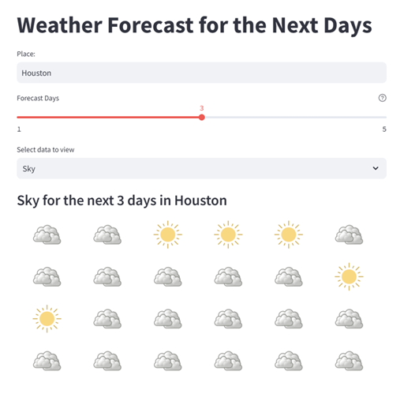
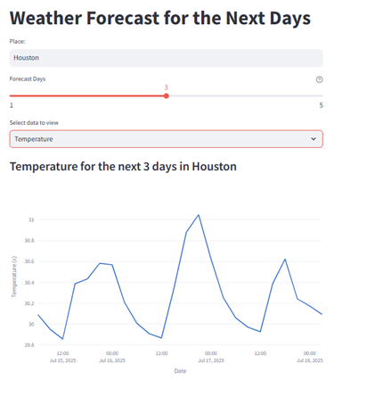

# 🌤 Weather Forecast App - Streamlit Project

This project is a simple and interactive **weather forecast application** built using **Streamlit** and **Plotly**. It allows users to check the forecasted **temperature** or **sky condition** for up to 5 days in any city, using data fetched from the **OpenWeatherMap API**.

## 📋 Features

- Input field to search for any city
- Slider to select the number of forecast days (1 to 5)
- Option to display either:
  - 📈 Temperature (with a line chart)
  - 🌥 Sky condition (with representative images)
- Error handling if the entered location doesn't exist
- Uses external `.env` file to securely manage the API key

## 🎯 Purpose

This application was built as part of my learning in **Python course** using **Streamlit**. It demonstrates the use of:
- External APIs (OpenWeatherMap)
- Data visualization with Plotly
- Environmental variables for security
- User input handling with Streamlit widgets

## 🛠️ Technologies Used

- Python
- Streamlit
- Plotly
- [OpenWeatherMap API](https://openweathermap.org/forecast5)
- `.env` for secret management (`python-dotenv`)

## ⚙️ Project Structure 

/WEATHER_PAGE

│
├── main.py # Main Streamlit application

├── backend.py # Logic to fetch and process weather data

├── .env # Stores the API key securely 

├── images/ # Weather condition icons (Clear, Cloud, Rain, Snow)

│ ├── clear.png

│ ├── cloud.png

│ ├── rain.png

│ └── snow.png

└── README.md

## 📎 Screenshot

## 👨‍💻 Author

Juan Jesús Cabrera Gómez  

